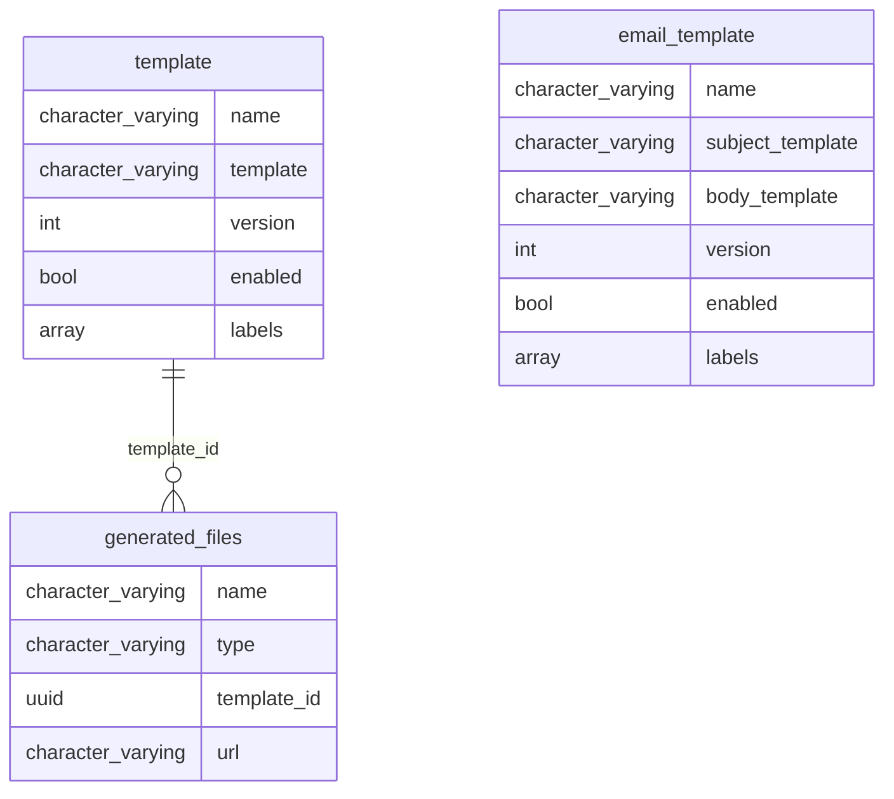

# STemplateApi

Simple ..., String ... , Super?
Liquid strings templates by API.

## Model



## Examples

```txt
That's my secret {{ hero.name }}: I'm always angry.
```

```json
{
  "hero": {
    "name": "Captain"
  }
}
```
